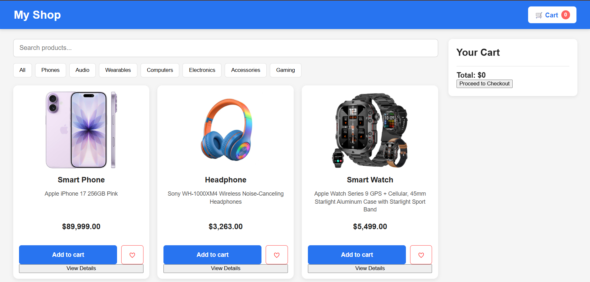
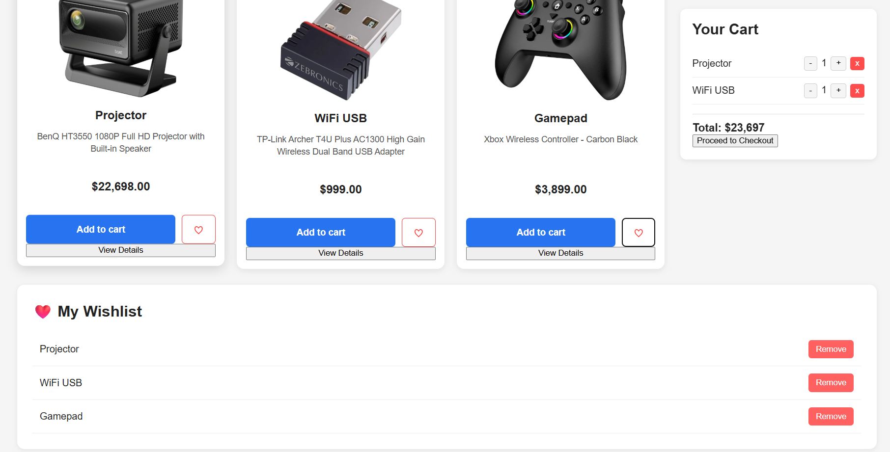
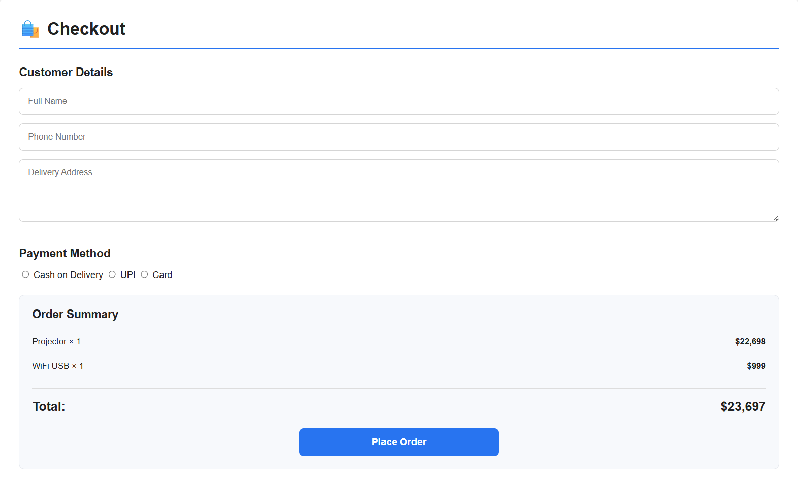
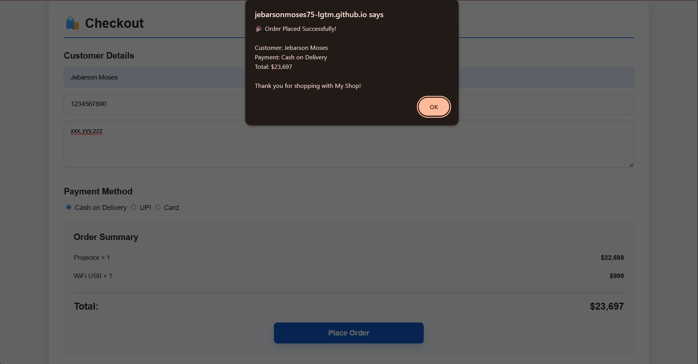

# 🛒 My Shop

### A Responsive E-Commerce Style Website

A responsive e-commerce-style website built using **HTML, CSS, and JavaScript**.

## 🌐 Live Demo

👉 [View My Shop Live Website](https://jebarsonmoses75-lgtm.github.io/MyShop/)]

## ✨ Features

- 🔍 Product Search
- 📂 Category Filtering
- 🛒 Shopping Cart
- ➕➖ Quantity Management
- ❤️ Wishlist
- 👁️ Product Details
- 🧾 Checkout Demo
- 📱 Responsive Design
- 💾 Local Storage

## 🛠️ Technologies Used

- HTML5
- CSS3
- JavaScript
- LocalStorage

## 📦 Products

The project includes different categories such as:

- Phones
- Audio
- Wearables
- Computers
- Electronics
- Accessories
- Gaming

## 🎯 Project Purpose

This project was created as a learning and portfolio project to practice frontend web development and JavaScript functionality.

## 👨‍💻 Developer

**Jebarson Moses S**

B.E. Computer Science and Engineering Student

## 📸 Project Screenshots

### 🏠 Home Page

### 🛒 Cart & Wishlist

### 🧾 Checkout

### ✅ Order Confirmation

